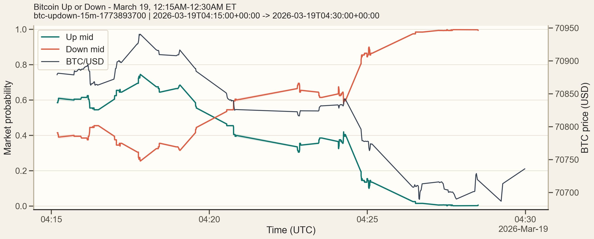
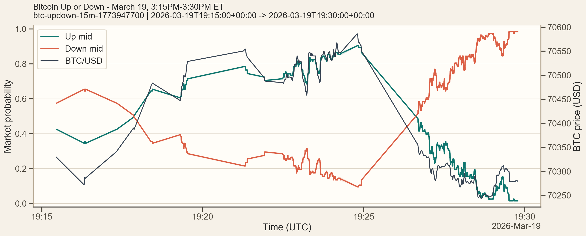
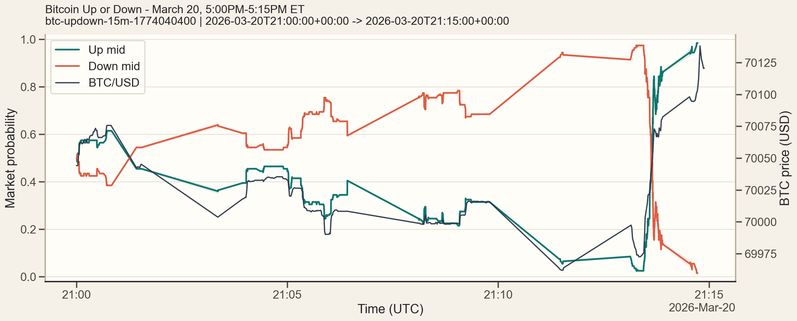

# Polymarket BTC 15 分钟工具集

这个仓库用于从 Dome 拉取 BTC 15 分钟 `Up/Down` Polymarket 市场的订单簿快照，对齐 Chainlink `btc/usd` 价格，转换成 CSV，并生成用于快速核验的图表。

## 仓库功能

- 解析形如 `btc-updown-15m-{slot_start_utc_timestamp}` 的市场名称。
- 只拉取市场真实活跃交易的 15 分钟窗口。
- 保存原始订单簿历史，或转换后的扁平化 CSV 快照。
- 为每个 15 分钟市场回填 Chainlink BTC 价格文件。
- 将 BTC 价格列合并回订单簿 CSV。
- 生成市场概览图，便于快速核验数据。

## 脚本说明

- `fetch_btc_15m_orderbooks.py`：拉取原始订单簿历史并保存为 `jsonl.gz`
- `convert_orderbooks_to_csv.py`：将原始 `jsonl.gz` 转成扁平 CSV，并保留前 N 档
- `fetch_btc_15m_orderbook_csvs.py`：直接导出订单簿 CSV
- `backfill_btc_price_files.py`：为每个市场写出 BTC 价格 JSON/CSV
- `merge_btc_prices_into_csvs.py`：把 BTC 价格列合并回订单簿 CSV
- `fetch_chainlink_prices.py`：单独拉取 Chainlink 价格
- `plot_market_overview.py`：为单个增强版市场绘制概览图
- `plot_up_down_btc_dual_axis.py`：绘制简单的双 Y 轴对比图
- `plot_up_down_combined_svg.py`：输出 SVG 版的 Up/Down 对比图

## 数据流程

推荐按顺序执行：

1. 先拉订单簿 CSV。
2. 再拉 BTC 价格文件。
3. 最后把 BTC 价格合并回订单簿 CSV。

示例：

```powershell
python fetch_btc_15m_orderbook_csvs.py --days 30 --output-dir data/btc_15m_orderbook_csv_month_seq
python backfill_btc_price_files.py --input-dir data/btc_15m_orderbook_csv_month_seq
python merge_btc_prices_into_csvs.py --input-dir data/btc_15m_orderbook_csv_month_seq
```

## 画图

为单个增强版市场生成概览图：

```powershell
python plot_market_overview.py `
  --up data/btc_15m_enriched_csv_month/2026-03-19/btc-updown-15m-1773893700__up.csv `
  --down data/btc_15m_enriched_csv_month/2026-03-19/btc-updown-15m-1773893700__down.csv `
  --output docs/examples/market_overview_1773893700.png
```

这张概览图是单面板，包含：

- `Up` 和 `Down` 的最优档中间价
- 右侧 Y 轴上的 BTC/USD 价格
- Up/Down 两边各自的 bid/ask 价格带

## 示例图

### 示例 1

`btc-updown-15m-1773893700`



原始数据：

- [btc-updown-15m-1773893700__up.csv](docs/example_csv/btc-updown-15m-1773893700__up.csv)
- [btc-updown-15m-1773893700__down.csv](docs/example_csv/btc-updown-15m-1773893700__down.csv)

### 示例 2

`btc-updown-15m-1773947700`



原始数据：

- [btc-updown-15m-1773947700__up.csv](docs/example_csv/btc-updown-15m-1773947700__up.csv)
- [btc-updown-15m-1773947700__down.csv](docs/example_csv/btc-updown-15m-1773947700__down.csv)

### 示例 3

`btc-updown-15m-1774040400`



原始数据：

- [btc-updown-15m-1774040400__up.csv](docs/example_csv/btc-updown-15m-1774040400__up.csv)
- [btc-updown-15m-1774040400__down.csv](docs/example_csv/btc-updown-15m-1774040400__down.csv)

## 说明

- `key.txt` 和 `data/` 已被 `.gitignore` 忽略，不会上传到仓库。
- Dome 的订单簿历史是事件驱动的，因此出现较长时间空档并不一定是异常。
- CSV 转换逻辑会先将 bids 按价格降序排序、asks 按价格升序排序，再截取最优档位。
